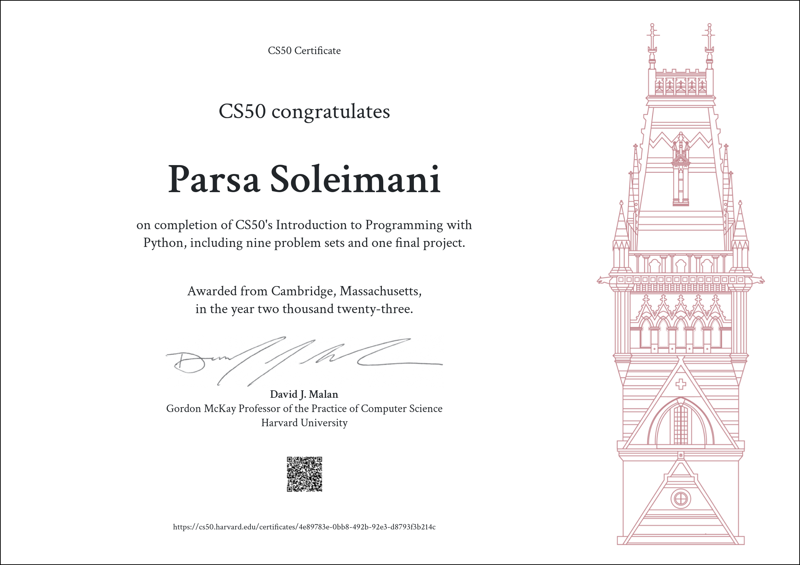

# My CS50P Projects
 
## About CS50P
CS50P is a python cource offered by Harvard as a part of their opencourseware project.It covers everything about python from the simplest functions and variables into OOP and beyond.
This repository consists of my codes regarding the problems and projects of this cource
## final project
the final project of mine on this cource is [Transit_Tehran_Tourism](https://github.com/parsoli83/Transit_Tehran_Tourism) which I highly recommend visiting.
This was CS50!